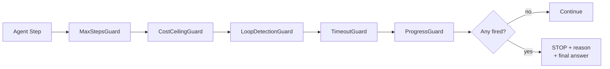
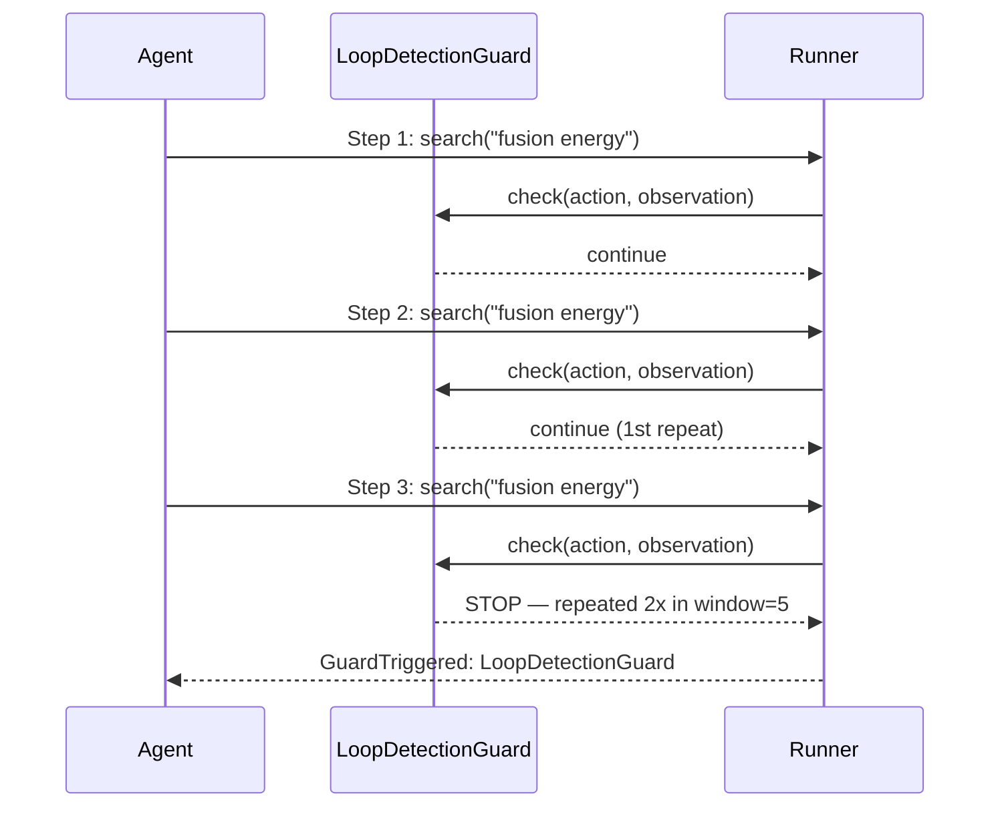

<p align="center">
  
</p>

<p align="center">
  <a href="https://python.org"></a>
  <a href="LICENSE"></a>
  
  
  
</p>

<p align="center"><b>Five stop-condition guards. Prevent infinite loops and runaway API costs in production.</b></p>

---

## The Problem: ReAct Agents Have No Brakes

```python
# This runs until YOUR money runs out
while not agent.is_done():
    agent.step()   # no guard = no ceiling
```

The ReAct loop is elegant in a notebook. In production, it's a ticking clock. "Done" is defined by the LLM — and a confused model loops forever.

| Failure Mode | What Happens | Real Cost |
|---|---|---|
| **Hard loop** | Same action, forever | $10–$500+ per stuck task |
| **Semantic loop** | Different words, same dead end | Silent budget burn |
| **Retry storm** | Broken tool retried 80× | 80× wasted API calls |
| **Scope creep** | Unbounded search expands forever | Hours of compute, no output |

---

## The Fix



---

## Five Guards

| Guard | Stops | Key Config |
|-------|-------|-----------|
| `MaxStepsGuard` | Hard step ceiling | `max_steps=50` |
| `CostCeilingGuard` | Token spend ceiling | `max_cost_usd=1.00` |
| `LoopDetectionGuard` | Repeated action-observation pairs | `window=5, min_repeats=2` |
| `TimeoutGuard` | Wall-clock time limit | `max_seconds=120` |
| `ProgressGuard` | Stalled / non-improving agent | `stall_threshold=3` |

---

## Quick Start

```bash
git clone https://github.com/darshjme/sentinel
cd sentinel && pip install -e .
```

```python
from react_guards import GuardedReActAgent, StepOutput
from react_guards.guards import (
    MaxStepsGuard, CostCeilingGuard, LoopDetectionGuard,
    TimeoutGuard, ProgressGuard, AgentState,
)

def my_agent_step(task: str, state: AgentState) -> StepOutput:
    response = call_your_llm(task, state)
    return StepOutput(
        action=response.action,
        observation=response.observation,
        is_done=response.finished,
        final_answer=response.answer,
        input_tokens=response.usage.input,
        output_tokens=response.usage.output,
    )

agent = GuardedReActAgent(
    agent_fn=my_agent_step,
    guards=[
        MaxStepsGuard(max_steps=50),
        CostCeilingGuard(max_cost_usd=1.00),
        LoopDetectionGuard(window=5),
        TimeoutGuard(max_seconds=120),
        ProgressGuard(stall_threshold=3),
    ],
)

result = agent.run("Research the latest advances in fusion energy")
print(f"Stopped by: {result.stopped_by}")   # "agent_done" or guard name
print(f"Steps: {result.steps_taken} | Cost: ${result.total_cost_usd:.4f}")
```

---

## Sequence: LoopDetection Catching a Stuck Agent



---

## Design Principles

1. **Zero dependencies** — pure Python stdlib. Drops into any stack.
2. **Composable** — use one guard or all five. Order doesn't matter.
3. **Stateless between runs** — `reset()` called automatically on each `agent.run()`.
4. **Protocol-based** — implement `should_stop / reason / reset` to build custom guards.
5. **Fail-safe** — guards never raise; they return `bool`.

Guard overhead: **< 1ms per step**. The bottleneck is always your LLM call.

---

## Part of Arsenal

```
verdict · sentinel · herald · engram · arsenal
```

| Repo | Purpose |
|------|---------|
| [verdict](https://github.com/darshjme/verdict) | Score your agents |
| [sentinel](https://github.com/darshjme/sentinel) | ← you are here |
| [herald](https://github.com/darshjme/herald) | Semantic task router |
| [engram](https://github.com/darshjme/engram) | Agent memory |
| [arsenal](https://github.com/darshjme/arsenal) | The full pipeline |

---

## License

MIT © [Darshankumar Joshi](https://github.com/darshjme) · Built as part of the [Arsenal](https://github.com/darshjme/arsenal) toolkit.
