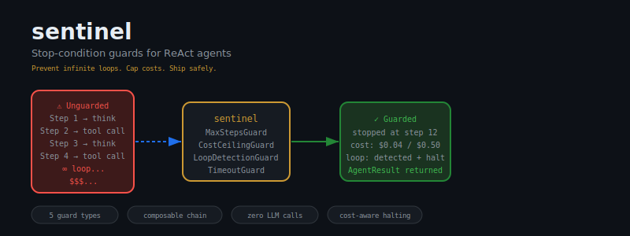
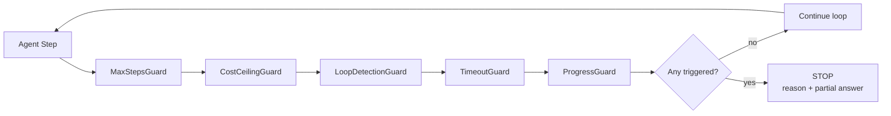
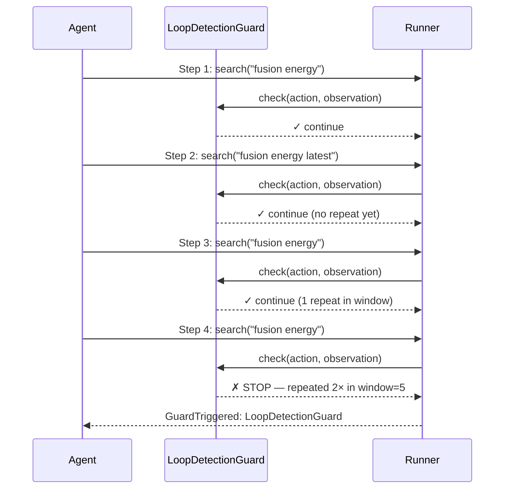

<p align="center">
  
</p>

<p align="center">
  <a href="https://python.org"></a>
  <a href="LICENSE"></a>
  
  
  
  
</p>

<p align="center">
  <b>Your agent will loop forever if you let it. sentinel won't let it.</b>
</p>

---

## The Problem

You ship a ReAct agent. It works perfectly in your notebook. Then at 2am, your monitoring pings you: **$47.83 billed in 6 minutes.** One task. One confused LLM. No exit condition.

This is not hypothetical. It's the default behavior.

```python
# Every unguarded ReAct loop looks like this in production
while not agent.is_done():
    agent.step()   # "done" is whatever the LLM decides
                   # and a stuck LLM never decides it's done
```

The ReAct pattern is powerful precisely because it's open-ended. That's also why it's dangerous. There is no timeout. No cost ceiling. No detection of "this agent has been calling the same tool for 20 steps." The loop runs until you stop paying for it — or until the API rate-limiter cuts it off, leaving you with a half-completed task and a full invoice.

**The four failure modes that will hit you in production:**

| Failure Mode | Mechanism | Observed Cost |
|---|---|---|
| **Hard loop** | Identical action–observation pair repeats verbatim | $10–$500 per stuck task |
| **Semantic loop** | Different phrasing, same dead end — LLM tries `search("X")`, then `search("what is X")`, then `search("X definition")` | Silent budget burn, hours undetected |
| **Retry storm** | Tool throws an exception; agent retries 80× without backoff | 80× wasted API calls + downstream service DoS |
| **Scope creep** | Research task spawns sub-queries, each spawns more; token count compounds exponentially | Unbounded compute, no coherent output |

None of these are bugs in your agent logic. They're the natural behavior of an LLM without a leash.

---

## The Solution

```python
from react_guards import GuardedReActAgent, StepOutput
from react_guards.guards import (
    MaxStepsGuard, CostCeilingGuard, LoopDetectionGuard,
    TimeoutGuard, ProgressGuard, AgentState,
)

def my_agent_step(task: str, state: AgentState) -> StepOutput:
    response = call_your_llm(task, state)
    return StepOutput(
        action=response.action,
        observation=response.observation,
        is_done=response.finished,
        final_answer=response.answer,
        input_tokens=response.usage.input,
        output_tokens=response.usage.output,
    )

agent = GuardedReActAgent(
    agent_fn=my_agent_step,
    guards=[
        MaxStepsGuard(max_steps=50),
        CostCeilingGuard(max_cost_usd=1.00),
        LoopDetectionGuard(window=5, min_repeats=2),
        TimeoutGuard(max_seconds=120),
        ProgressGuard(stall_threshold=3),
    ],
)

result = agent.run("Research the latest advances in fusion energy")

print(f"Stopped by: {result.stopped_by}")       # "agent_done" or guard name
print(f"Steps taken: {result.steps_taken}")
print(f"Total cost: ${result.total_cost_usd:.4f}")
print(f"Answer: {result.final_answer}")
```

That's it. Wrap your existing agent function. Add guards. The loop is now bounded.



---

## Install

```bash
git clone https://github.com/darshjme/sentinel
cd sentinel
pip install -e .
```

Zero external dependencies. Drops into any Python 3.11+ stack.

---

## The Five Guards

### `MaxStepsGuard` — Hard Step Ceiling

The simplest guard. The most important one. If your agent hasn't finished in `N` steps, it never will.

```python
MaxStepsGuard(max_steps=50)
```

**When it fires:** step count ≥ `max_steps`.

**What to set:** For a focused task (summarize, classify, answer), set 10–20. For agentic research, 50–100. For autonomous pipelines, 200 max. Above 200 steps, you need to rethink your agent architecture, not raise the ceiling.

**Why it's not enough alone:** A hard cap doesn't tell you *why* the agent stalled. Use it as a last-resort backstop, not your primary guard.

---

### `CostCeilingGuard` — Token Spend Ceiling

Tracks cumulative token cost across every step. Fires before the next step would breach your budget.

```python
CostCeilingGuard(
    max_cost_usd=1.00,
    input_cost_per_1k=0.003,    # GPT-4o pricing
    output_cost_per_1k=0.015,
)
```

**When it fires:** projected total cost ≥ `max_cost_usd` before executing the next LLM call.

**What to set:** Set this to 2–5× your expected task cost. If a task should cost $0.10, cap at $0.50. The overhead gives legitimate multi-step tasks room to breathe while stopping runaway loops before they compound.

**Model pricing defaults (built-in):**

| Model family | Input/1K tokens | Output/1K tokens |
|---|---|---|
| GPT-4o | $0.005 | $0.015 |
| GPT-4o-mini | $0.00015 | $0.0006 |
| Claude 3.5 Sonnet | $0.003 | $0.015 |
| Claude 3 Haiku | $0.00025 | $0.00125 |

Pass your own rates for any model.

---

### `LoopDetectionGuard` — Semantic Loop Detector

Detects when the agent is cycling through the same reasoning pattern without making progress. Works on both exact and near-duplicate action–observation pairs.

```python
LoopDetectionGuard(
    window=5,           # look at the last N steps
    min_repeats=2,      # fire after this many repeats within the window
)
```

**When it fires:** The same `(action, observation)` pair appears `min_repeats` times within the last `window` steps.

**What it catches that MaxSteps misses:** An agent can take 200 unique steps but still be looping semantically. "Search query A → no result" → "Search query B (synonym of A) → no result" is a loop even if the strings differ. Configure `min_repeats=2, window=5` for aggressive detection or `min_repeats=3, window=10` for permissive.



---

### `TimeoutGuard` — Wall-Clock Time Limit

Sets a hard time budget in seconds, measured from the first `agent.run()` call. Immune to token counting, model choice, or tool latency.

```python
TimeoutGuard(max_seconds=120)   # 2 minutes hard cap
```

**When it fires:** elapsed wall time ≥ `max_seconds` at any guard check point.

**What it protects against:** Slow tools, hanging HTTP calls, rate-limit backoff spirals. A cost ceiling only counts what gets billed. If your agent is waiting on a slow external API call, the cost guard is blind — TimeoutGuard is not.

**Typical values:**
- Interactive user task (chat assistant): 15–30s
- Background research task: 120–300s  
- Autonomous pipeline step: 600s max

---

### `ProgressGuard` — Stall Detector

Detects when the agent is making syntactically different moves but not converging toward a final answer. Measures observation diversity — if new observations aren't adding information, the agent is stalling.

```python
ProgressGuard(stall_threshold=3)   # halt after 3 consecutive non-novel steps
```

**When it fires:** `stall_threshold` consecutive steps produce observations below the novelty threshold (configurable; default: 80% similarity to recent observations).

**What it catches:** The "busy work" loop — an agent that keeps calling tools, getting responses, but never building toward a conclusion. Common in research tasks where the model has enough information but won't commit to an answer.

---

## Composing Guards

Guards are checked in order. The first one to trigger stops the loop. Design your chain with this in mind: put the cheapest guards first (MaxSteps, Timeout — O(1)) and more expensive ones later.

```python
# Minimal production setup (every agent should have at least these three)
guards = [
    MaxStepsGuard(max_steps=50),
    CostCeilingGuard(max_cost_usd=2.00),
    TimeoutGuard(max_seconds=180),
]

# Full production setup for a research agent
guards = [
    MaxStepsGuard(max_steps=100),
    CostCeilingGuard(max_cost_usd=1.00, input_cost_per_1k=0.003, output_cost_per_1k=0.015),
    LoopDetectionGuard(window=5, min_repeats=2),
    TimeoutGuard(max_seconds=300),
    ProgressGuard(stall_threshold=4),
]

# Tight budget — single-shot QA task
guards = [
    MaxStepsGuard(max_steps=10),
    CostCeilingGuard(max_cost_usd=0.10),
    TimeoutGuard(max_seconds=30),
]
```

**Custom guards** — implement the protocol:

```python
from react_guards.guards import AgentState

class MyCustomGuard:
    def should_stop(self, state: AgentState) -> bool:
        # Return True to halt the agent
        return state.steps_taken > 0 and state.last_observation == ""

    def reason(self) -> str:
        return "MyCustomGuard: empty observation detected"

    def reset(self) -> None:
        pass   # clear any per-run state here
```

Drop it into the guards list. No registration, no subclassing required.

---

## Reading the Result

```python
result = agent.run("Your task")

result.stopped_by        # str: "agent_done" | guard class name
result.steps_taken       # int: total steps executed
result.total_cost_usd    # float: cumulative token cost
result.final_answer      # str | None: last answer from agent_fn
result.step_history      # list[StepOutput]: full trace
result.elapsed_seconds   # float: wall time
```

If `stopped_by == "agent_done"`, the agent completed normally. Any other value is a guard name — log it, alert on it, use it for retrospective analysis.

---

## Production Checklist

These five guards should be non-negotiable for any agent running against real API keys:

- [ ] **`MaxStepsGuard(max_steps=50)`** — Absolute ceiling. Always. No exceptions. An agent that needs more than 50 steps for a discrete task is architecturally broken.
- [ ] **`CostCeilingGuard(max_cost_usd=1.00)`** — Set to 5–10× expected task cost. Log every trigger. If this fires in production, something went wrong and you need to know.
- [ ] **`LoopDetectionGuard(window=5, min_repeats=2)`** — Catches what MaxSteps misses. A 50-step loop is still $5 wasted before the ceiling hits.
- [ ] **`TimeoutGuard(max_seconds=120)`** — Mandatory for user-facing tasks. Your users will not wait 10 minutes for a response.
- [ ] **`ProgressGuard(stall_threshold=3)`** — For research/multi-step tasks. Stops the agent from appearing productive while going nowhere.

**Log every guard trigger.** Patterns in your guard logs tell you more about your agent's failure modes than any eval benchmark.

---

## Design Principles

1. **Zero dependencies** — pure Python stdlib. No numpy, no pydantic, no LangChain. Drops into any stack without version conflicts.
2. **Composable** — use one guard or all five. Guards are checked independently; adding one never changes the behavior of another.
3. **Stateless between runs** — `reset()` is called automatically on every `agent.run()`. No shared state between tasks.
4. **Protocol-based** — custom guards require only `should_stop`, `reason`, and `reset`. No inheritance required.
5. **Fail-safe** — guards never raise exceptions. A guard that errors defaults to `False` (continue) and logs the error. Your agent won't die because a guard threw.
6. **Measurable** — every `AgentResult` carries the full audit trail: steps, cost, time, guard that fired, complete step history.

**Overhead:** < 1ms per step per guard. The bottleneck is always the LLM call. sentinel adds no meaningful latency.

---

## Philosophy

> Arjuna stood on the battlefield of Kurukshetra, overwhelmed and paralysed — about to make catastrophic, irreversible decisions. He had the skill. He had the weapons. What he lacked was a check on his own judgment in the heat of the moment.
>
> Krishna was that check.
>
> Your ReAct agents are Arjuna. They have the tools, the reasoning capability, the context. What they lack — by design — is the ability to recognize when they've gone off the rails. They will not tell you they're looping. They will not stop when the cost gets absurd. They will not notice that they've been asking the same question for 40 steps.
>
> **sentinel is Krishna.** Not a replacement for intelligence — a guardian against its failure modes.

The most dangerous thing about a looping agent is that it *looks* like it's working. The logs scroll. The API calls return. The cost meter climbs. Everything appears normal until you read the bill.

Stop the loop before the loop stops your budget.

---

## Part of the Arsenal

```
verdict · sentinel · herald · engram · arsenal
```

| Repo | Role |
|------|------|
| [verdict](https://github.com/darshjme/verdict) | Score and evaluate your agents |
| **sentinel** | ← Stop-condition guards (you are here) |
| [herald](https://github.com/darshjme/herald) | Semantic task routing |
| [engram](https://github.com/darshjme/engram) | Agent memory layer |
| [arsenal](https://github.com/darshjme/arsenal) | Full production pipeline |

---

## License

MIT © [Darshankumar Joshi](https://github.com/darshjme) · Part of the [Arsenal](https://github.com/darshjme/arsenal) agent toolkit.
